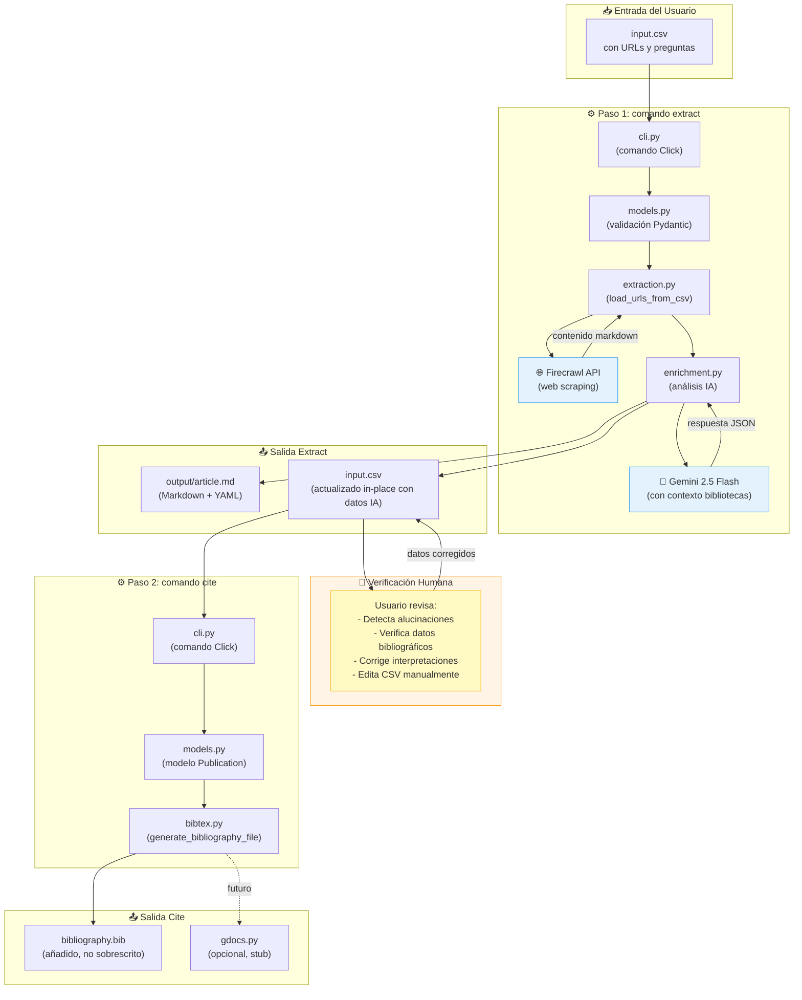

### **Documento de Requisitos del Producto (PRD)**

---

#### **1. Resumen General**

Este documento describe los requisitos para **CiteCrawl**, un pipeline potenciado con IA para la extracción de contenido web y la gestión de citas bibliográficas.

**Nombre del Proyecto:** CiteCrawl
**Audiencia Objetivo:** Bibliotecas públicas y comunitarias de Iberoamérica, investigadores, estudiantes y trabajadores del conocimiento
**Misión Central:** Ayudar a las bibliotecas a integrar la inteligencia artificial de forma ética, crítica y con un enfoque centrado en el ser humano

CiteCrawl es una herramienta de interfaz de línea de comandos (CLI) que **asiste** (no automatiza) el proceso de recolectar, analizar y citar recursos basados en la web. La herramienta enfatiza la transparencia sobre las limitaciones de la IA y se posiciona como un asistente humano en lugar de un reemplazo para el pensamiento crítico.

#### **2. El Usuario y El Problema**

*   **¿Quién es el usuario?**
    - Primario: Bibliotecarios y especialistas en información de bibliotecas públicas/comunitarias en Iberoamérica
    - Secundario: Investigadores, estudiantes y trabajadores del conocimiento que procesan múltiples fuentes web

*   **¿Cuál es el problema?** El flujo de trabajo actual para procesar múltiples fuentes web es tedioso y consume mucho tiempo:
    1.  Guardar manualmente el contenido de cada URL
    2.  Leer artículos para extraer información clave
    3.  Encontrar y formatear información bibliográfica para citas
    4.  Llevar registro de qué fuentes han sido procesadas
    5.  Formatear citas de manera consistente

*   **¿Qué NO es el problema?** La evaluación crítica y la verificación. Estas siguen siendo tareas humanas esenciales.

**Solución Actual:** La herramienta **reduce el trabajo repetitivo** (extracción, resumen inicial) pero **no elimina** la necesidad de verificación humana. Está diseñada para manejar las partes tediosas para que los usuarios puedan enfocar su experiencia en la evaluación crítica, interpretación contextual y asegurar la precisión.

#### **3. Historias de Usuario**

*   **Historia 1: Extracción de Contenido**

    Como bibliotecaria, quiero proporcionar un archivo CSV con URLs para que la herramienta extraiga y guarde el contenido principal de cada página como archivos Markdown limpios, permitiéndome tener una copia local para análisis.

    **Criterios de Aceptación:**
    - La herramienta lee CSV con columna `Enlace/URL`
    - Extrae contenido vía API de Firecrawl
    - Guarda cada página como Markdown con encabezado YAML
    - Omite URLs ya marcadas como `Extracted=TRUE`
    - Actualiza el CSV con el estado de extracción

*   **Historia 2: Enriquecimiento Asistido por IA con Preguntas Personalizadas** ⭐

    Como investigador, quiero poder dejar campos del CSV vacíos (para llenado automático) O escribir preguntas específicas en ellos, para que la IA lea cada artículo e intente responder mis preguntas, dándome extracción de información dirigida.

    **Criterios de Aceptación:**
    - La IA llena campos vacíos con información extraída
    - La IA interpreta preguntas en los campos (ej. "¿Cómo se relaciona esto con bibliotecas?")
    - La IA intenta responder preguntas basándose en el contenido del artículo
    - Los resultados se guardan de vuelta en el CSV (actualización in-place)
    - La herramienta extrae metadatos bibliográficos (título, autor, año)
    - **Contexto específico de bibliotecas**: La IA prioriza consideraciones éticas, aplicaciones prácticas e impacto comunitario

*   **Historia 3: Flujo de Verificación Humana**

    Como usuario, quiero orientación clara de que debo verificar las salidas de la IA antes de usarlas, para mantener control de calidad y detectar errores o alucinaciones.

    **Criterios de Aceptación:**
    - La documentación enfatiza verificación en cada paso
    - La herramienta se posiciona como "generador de borradores" no "generador de verdad"
    - El README incluye ejemplos de qué puede salir mal
    - El flujo de trabajo incluye explícitamente un paso de "revisar y corregir"

*   **Historia 4: Gestión de Citas**

    Como investigadora, quiero generar un archivo BibTeX desde mis fuentes verificadas para poder importar citas en mi gestor de referencias o documento LaTeX.

    **Criterios de Aceptación:**
    - Genera `bibliography.bib` desde datos del CSV
    - Se añade al archivo existente (preserva citas previas)
    - Usa formato BibTeX estándar compatible con Zotero/Mendeley
    - Crea claves de citación únicas desde autor/año/título

*   **Historia 5: Integración con Google Docs** (Futuro/Opcional)

    Como usuario, quiero actualizar citas en mi Google Doc con un comando, para mantener mi manuscrito con referencias apropiadas.

    **Estado:** Actualmente stub, planificado para implementación futura

#### **4. Arquitectura Actual**

El proyecto sigue una arquitectura modular de pipeline con clara separación de responsabilidades. Todo el código fuente reside en el paquete `citecrawl`, con cobertura de tests exhaustiva en el directorio `tests`.

**Stack Tecnológico:**
- **Framework CLI**: Click (interfaz de línea de comandos)
- **Logging**: Rich (salida colorida y formateada en consola)
- **Web Scraping**: Firecrawl API (firecrawl-py)
- **Enriquecimiento con IA**: Google Gemini 2.5 Flash (google-generativeai)
- **Validación de Datos**: Pydantic (con alias de campos en español)
- **Testing**: pytest, pytest-cov, pytest-mock
- **Entorno**: python-dotenv para configuración
- **Gestor de Paquetes**: uv (instalador rápido de paquetes Python)

**Estructura del Proyecto:**

```
CiteCrawl/
├── .env                    # Claves de API (gitignored)
├── .gitignore
├── pyproject.toml          # Metadatos del proyecto
├── requirements.txt        # Dependencias
├── uv.lock                 # Archivo de bloqueo de dependencias
├── coverage.svg            # Badge de cobertura dinámico
├── bibliography.bib        # Citas generadas (gitignored)
├── run_pipeline.ps1        # Script de automatización PowerShell
│
├── Documentación/
│   ├── README.md           # Docs para usuarios (Español)
│   ├── PRD.md              # Este archivo - Requisitos del producto
│   ├── CONTRIBUTING.md     # Guía de contribución con filosofía IA
│   ├── CLAUDE.md           # Contexto para Claude Code
│   └── GEMINI.md           # Contexto para Gemini
│
├── data/                   # Datos de usuario (no en repo)
│   └── csv_with_links/
│       └── input.csv
│
├── output/                 # Contenido extraído (gitignored)
│   └── article_name.md     # Markdown con encabezado YAML
│
├── citecrawl/              # Código fuente principal
│   ├── __init__.py
│   ├── __main__.py         # Punto de entrada del paquete
│   ├── cli.py              # Comandos Click (extract, cite)
│   ├── models.py           # Modelos de datos Pydantic
│   ├── extraction.py       # Lógica de web scraping
│   ├── enrichment.py       # Enriquecimiento IA con Gemini
│   ├── bibtex.py           # Generación de BibTeX
│   └── gdocs.py            # Integración Google Docs (stub)
│
└── tests/                  # Suite de tests (meta: 100% cobertura)
    ├── __init__.py
    ├── conftest.py         # Fixtures de Pytest
    ├── test_cli.py
    ├── test_models.py
    ├── test_extraction.py
    ├── test_enrichment.py
    ├── test_bibtex.py
    └── test_gdocs.py
```

**Decisiones Arquitectónicas Clave:**

1. **Modelos Pydantic**: Toda validación de datos usa Pydantic con aliases de campos para mapear nombres de columnas CSV en español a atributos Python en inglés

2. **Actualizaciones CSV In-Place**: La herramienta modifica el archivo CSV original, actualizándolo con datos enriquecidos. Esto permite procesamiento incremental.

3. **Markdown + Encabezado YAML**: El contenido extraído se guarda como Markdown con metadatos en encabezado YAML, permitiendo lectura humana y análisis por máquina.

4. **Manejo Defensivo de Errores**: Tanto extracción como enriquecimiento retornan resultados parciales en caso de errores, permitiendo que el procesamiento por lotes continúe.

5. **Comportamiento de Append en BibTeX**: Las citas se añaden para preservar entradas existentes al procesar múltiples archivos CSV.

6. **Desarrollo Guiado por Tests**: Metodología TDD estricta usando pytest con metas de alta cobertura.

#### **5. Diagrama de Arquitectura y Flujo de Datos**

Este diagrama ilustra el flujo completo de datos a través del pipeline de CiteCrawl, mostrando tanto los componentes técnicos como los pasos de verificación humana.



**Características Clave Destacadas en el Diagrama:**

1. **Validación Pydantic** (`models.py`): Todos los datos CSV pasan por modelos Pydantic con aliases de campos en español
2. **Preguntas Personalizadas**: Los usuarios pueden poner preguntas directamente en los campos del CSV
3. **Contexto de Bibliotecas**: Gemini recibe contexto especial para priorizar información relevante para bibliotecas
4. **Actualizaciones In-Place**: El CSV se actualiza con datos generados por IA, no se copia
5. **Ciclo de Verificación Humana**: Paso explícito mostrando que el usuario debe revisar antes de generar citas
6. **Markdown + YAML**: La salida incluye contenido legible por humanos y metadatos analizables por máquina
7. **Comportamiento de Append**: bibliography.bib se añade, no se sobrescribe

---

#### **6. Filosofía del Proyecto: La IA como Asistente, No como Oráculo**

**Principios Fundamentales:**

1. **Las Limitaciones de la IA son Reales**:
   - Los LLMs pueden alucinar (inventar información que suena plausible pero es falsa)
   - Parafrasear puede cambiar sutilmente los significados
   - Los resúmenes reflejan la interpretación de la IA, no la verdad objetiva
   - Los datos bibliográficos pueden estar incorrectos o inventados

2. **La Verificación Humana es Obligatoria**:
   - La herramienta reduce el trabajo tedioso pero no elimina la verificación
   - Los usuarios deben revisar y corregir las salidas de la IA
   - La herramienta se posiciona como un "asistente" no como "automatización"

3. **Transparencia sobre Marketing**:
   - El README enfatiza las limitaciones prominentemente
   - Usa lenguaje como "borrador", "inicial", "necesita verificación"
   - Evita afirmaciones de "eliminar" trabajo manual

4. **Tono Amigable para Principiantes**:
   - La documentación es empática y clara
   - Asume que los lectores pueden ser nuevos en herramientas de línea de comandos
   - Explica conceptos técnicos en términos simples
   - Proporciona ejemplos concretos con rutas reales

**Este proyecto practica lo que predica**: Si estamos ayudando a bibliotecas a usar IA responsablemente, nuestro código y documentación deben reflejar esa filosofía.

---
