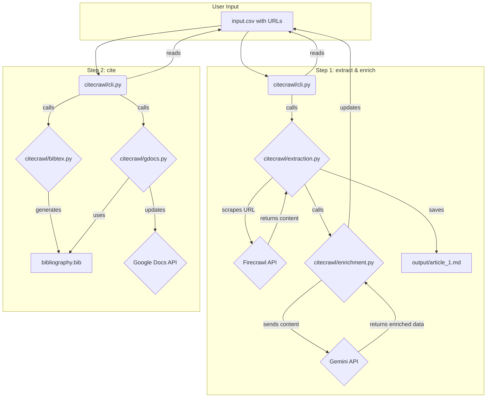

### **Product Requirements Document (PRD)**

---

#### **1. Overview**

This document outlines the requirements for the "Web Content to Citation" AI Pipeline. The tool is a command-line interface (CLI) designed to automate the process of collecting, analyzing, and citing web-based resources for research and writing.

#### **2. The User & The Problem**

*   **Who is the user?** A researcher, student, or knowledge worker who needs to process a large number of web articles.
*   **What is the problem?** The user's current workflow is manual and time-consuming. It involves:
    1.  Manually saving content from links.
    2.  Reading through each article to find answers to specific questions.
    3.  Manually finding and formatting bibliographic information for citations.
    4.  Manually updating citations in their documents.

This process is a significant bottleneck, taking time away from actual analysis and writing.

#### **3. User Stories**

*   **Story 1: Extraction:** As a user, I want to provide a CSV file with a list of URLs so that the tool can automatically scrape and save the main content of each page locally. The CSV file will have the following columns: `ID`, `Título`, `Autor(es)`, `Año de Publicación`, `Tipo de Recurso`, `Enlace/URL`, `Resumen Principal`, `Aspectos Más Relevantes (Relacionado con Bibliotecas)`, `Comentarios / Ideas para la Guía`, and `Extracted`. The `Extracted` field is a boolean that indicates whether the data has been processed. The user may fill in some fields manually.
*   **Story 2: Enrichment:** As a user, I want the AI to read the scraped content and automatically fill in the missing fields in the CSV file, such as `Resumen Principal` and `Aspectos Más Relevantes`. This process will also extract key bibliographic metadata (Title, Author, Year, URL) to complete the CSV record.
*   **Story 3: Citation Management:** As a user, I want to generate a standard `bibliography.bib` file from all my processed sources so I can easily manage my citations.
*   **Story 4: Google Docs Integration:** As a user, I want to run a single command to update the citations in my Google Doc manuscript, using the generated BibTeX file.

#### **4. Proposed Architecture**

To ensure the project is maintainable, testable, and scalable, we will adopt a structured layout. All source code will reside in a `citecrawl` directory, with a separate `tests` directory.

**New File Structure:**

```
CiteCrawl/
├── .env
├── .gitignore
├── data/
│   └── input.csv
├── output/
│   └── article_1.md
├── results/
│   └── enriched_metadata.csv
├── citecrawl/
│   ├── __init__.py
│   ├── __main__.py
│   ├── cli.py          # Main entry point with Click commands
│   ├── extraction.py   # Was scraper_module.py
│   ├── enrichment.py   # Was enricher_module.py
│   ├── bibtex.py       # Was bibtex_module.py
│   └── gdocs.py        # Was gdocs_module.py
├── tests/
│   ├── __init__.py
│   ├── test_extraction.py
│   └── test_enrichment.py
├── requirements.txt
├── PRD.md
└── GEMINI.md
```

#### **5. Architecture & Data Flow Diagram (Mermaid)**

This diagram illustrates the flow of data and the interaction between the different components of the pipeline.



---
