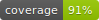

# Pipeline de IA: De Contenido Web a Citas Bibliográficas

[](https://www.python.org/downloads/)

[](https://click.palletsprojects.com/)
[](https://opensource.org/licenses/MIT)

Una herramienta de línea de comandos con IA que te ayuda a recolectar, analizar y citar fuentes web. Este pipeline acelera tu flujo de investigación al extraer contenido de páginas web, generar resúmenes iniciales y crear un borrador de bibliografía BibTeX.

> **💡 Filosofía del proyecto**: Esta herramienta practica lo que predica. Está diseñada para ayudar a bibliotecas a usar IA de forma crítica y ética. Por eso, **no pretende reemplazar tu criterio**, sino ser tu asistente para las tareas repetitivas.

## El Problema

Si eres investigador, estudiante o bibliotecario, sabes que procesar múltiples fuentes web es agotador: guardar el contenido, leerlo para encontrar información clave, extraer datos bibliográficos y formatear citas consume mucho tiempo.

**Esta herramienta reduce ese trabajo tedioso**, pero no lo elimina por completo. La IA te da un primer borrador rápido, y tú aportas lo más importante: **tu criterio y verificación**. Piénsalo como tener un asistente que hace el trabajo pesado, pero tú sigues siendo quien toma las decisiones finales.

## ⚠️ Importante: Lo que Debes Saber Antes de Empezar

**La IA es un asistente, no un oráculo.** Es importante entender sus limitaciones:

- ✅ **Lo que hace bien**: Extraer texto, identificar patrones, generar resúmenes iniciales
- ⚠️ **Lo que debes verificar siempre**:
  - Los datos bibliográficos (autor, año, título) pueden estar incorrectos o inventados
  - Los resúmenes reflejan la interpretación de la IA, no necesariamente la tuya
  - La IA puede "parafrasear" de formas que cambian sutilmente el significado
  - Puede "alucinar" información que parece real pero no existe en el texto original

**Tu trabajo crítico es insustituible:** Después de que la IA procese tus fuentes, necesitas revisar y corregir. La herramienta te ahorra horas de trabajo repetitivo, pero **no reemplaza tu capacidad de evaluar, interpretar y verificar**.

## Características Principales

-   **Extracción Automática**: Dale un archivo CSV con URLs y la herramienta guardará el contenido principal de cada página en archivos Markdown limpios.
-   **Resúmenes con IA**: La IA genera un resumen inicial del contenido. Revísalo siempre - puede omitir detalles importantes o interpretar diferente a ti.
-   **Extracción de Datos Bibliográficos**: La IA intenta identificar título, autor y año. **Estos datos necesitan verificación** - la IA puede equivocarse o inventar información.
-   **Citas en Formato BibTeX**: Genera un borrador del archivo `bibliography.bib`, compatible con gestores de referencias como Zotero o Mendeley. Revisa las entradas antes de usarlas.
-   **Integración con Google Docs**: (Opcional, en desarrollo) Actualiza las citas en tu manuscrito de Google Docs.

## Cómo Empezar

Si es tu primera vez usando herramientas de línea de comandos, está bien si te toma tiempo - todos empezamos así.

### Requisitos

-   **Python 3.6 o superior** - Si no lo tienes, descárgalo de [python.org](https://www.python.org/downloads/)
-   **[uv](https://github.com/astral-sh/uv)** - Un instalador de paquetes de Python muy rápido
-   **Claves de API** (gratuitas):
    -   [Firecrawl](https://www.firecrawl.dev/) - Para extraer contenido web
    -   [Google AI Studio](https://aistudio.google.com/) - Para el análisis con IA (Gemini)

> 💡 **¿Nuevo en esto?** Las "claves de API" son como contraseñas que permiten a tu computadora usar estos servicios. Regístrate en los enlaces de arriba para obtenerlas gratis.

### Instalación

1.  **Descarga el proyecto:**

    Si sabes usar git:
    ```bash
    git clone https://github.com/tu-usuario/CiteCrawl.git
    cd CiteCrawl
    ```

    Si no, descarga el proyecto como ZIP desde GitHub y descomprímelo, luego abre una terminal en esa carpeta.

2.  **Crea un entorno virtual** (esto mantiene las dependencias separadas):
    ```bash
    uv venv
    ```

3.  **Activa el entorno virtual:**

    En Windows:
    ```bash
    .venv\Scripts\activate
    ```

    En Mac/Linux:
    ```bash
    source .venv/bin/activate
    ```

    Sabrás que funcionó cuando veas `(.venv)` al inicio de tu línea de comandos.

4.  **Instala las dependencias** (las bibliotecas que necesita el proyecto):
    ```bash
    uv pip install -r requirements.txt
    ```

    Esto puede tomar unos minutos. Es normal.

5.  **Configura tus claves de API:**

    Crea un archivo llamado `.env` en la carpeta del proyecto (puedes usar el Bloc de notas o cualquier editor de texto). Copia y pega esto, reemplazando con tus claves reales:

    ```
    FIRECRAWL_API_KEY="tu_clave_de_firecrawl_aquí"
    GEMINI_API_KEY="tu_clave_de_gemini_aquí"
    ```

    ⚠️ **Importante**: Nunca compartas este archivo `.env` ni lo subas a internet. Contiene tus claves privadas.

## Modo de Uso

El proceso tiene dos pasos principales. Tómate tu tiempo para entender cada uno:

### Paso 1: Extraer y Enriquecer Contenido

**¿Qué hace?** Lee las URLs de tu archivo CSV, descarga el contenido de cada página, pide a la IA que extraiga información y lo guarda todo en archivos Markdown.

**¿Qué necesitas?** Un archivo CSV (Excel guardado como CSV) con tus URLs. La columna importante se debe llamar `Enlace/URL`.

*Ejemplo de cómo debe verse tu `input.csv`:*
```csv
ID,Título,Autor(es),Año de Publicación,Tipo de Recurso,Enlace/URL,Resumen Principal,Aspectos Más Relevantes (Relacionado con Bibliotecas),Comentarios / Ideas para la Guía,Extracted
1,"","","",,"https://ejemplo.com/articulo1","","","","",FALSE
2,"","","",,"https://ejemplo.org/articulo2","","","","",FALSE
```

> 💡 **Consejo**: Puedes dejar los otros campos vacíos. La IA intentará llenarlos por ti, pero tú los revisarás después.

**Comando para ejecutar:**
```bash
uv run python -m citecrawl extract ruta/a/tu/input.csv
```

Por ejemplo, si tu archivo se llama `mis_fuentes.csv` y está en tu escritorio:
```bash
uv run python -m citecrawl extract C:\Users\TuNombre\Desktop\mis_fuentes.csv
```

Los resultados se guardan en la carpeta `output/` por defecto. Puedes cambiar esto con `--output otra_carpeta`.

**⚠️ Después de este paso**: Abre tu archivo CSV y los archivos Markdown generados. **Revisa y corrige** la información que la IA extrajo. Busca errores, información inventada o interpretaciones incorrectas.

### Paso 2: Generar Citas

**¿Qué hace?** Lee tu archivo CSV (ya revisado y corregido por ti) y genera un archivo `bibliography.bib` con todas las citas en formato BibTeX.

**Requisito importante**: Primero debes haber completado el Paso 1 **y verificado la información**. No generes citas con datos sin revisar.

**Comando para ejecutar:**
```bash
# Genera el archivo bibliography.bib
uv run python -m citecrawl cite ruta/a/tu/input.csv
```

Por ejemplo:
```bash
uv run python -m citecrawl cite C:\Users\TuNombre\Desktop\mis_fuentes.csv
```

**Nota**: Este comando **agrega** entradas al archivo `bibliography.bib` existente, no lo sobrescribe. Si quieres empezar de cero, borra el archivo `bibliography.bib` antes de ejecutar el comando.

**Integración con Google Docs** (opcional, en desarrollo):
```bash
uv run python -m citecrawl cite ruta/a/tu/input.csv --doc-id "el_id_de_tu_documento"
```

## Flujo de Trabajo Recomendado

Para obtener mejores resultados, sigue este proceso:

1. **Prepara tu CSV** con todas las URLs que quieres procesar
2. **Ejecuta `extract`** para que la IA haga el trabajo inicial
3. ☕ **Tómate un café** - esto puede tomar tiempo si tienes muchas URLs
4. **Revisa los resultados** - Lee los archivos Markdown y el CSV actualizado
5. ✏️ **Corrige errores** - Edita el CSV con la información correcta
6. **Ejecuta `cite`** para generar tu bibliografía con datos verificados
7. **Revisa el archivo .bib** antes de usarlo en tu trabajo

## Preguntas Frecuentes

### ¿La IA se puede equivocar?

Sí, y lo hará. Las IAs generativas como Gemini pueden:
- Confundir información de diferentes partes del texto
- Inventar datos que suenan plausibles pero son falsos
- Interpretar el contenido de forma diferente a como tú lo harías

Por eso **la verificación humana es obligatoria**, no opcional.

### ¿Puedo confiar en los resúmenes?

Úsalos como punto de partida, no como verdad absoluta. Siempre compara el resumen con el artículo original. La IA puede omitir matices importantes o enfatizar aspectos diferentes a los que tú considerarías clave.

### ¿Qué hago si un campo está vacío o dice "Unknown"?

Significa que la IA no pudo extraer esa información. Busca los datos manualmente en el artículo original y edita el CSV.

### ¿Puedo procesar cualquier tipo de página web?

La herramienta funciona mejor con artículos, blogs y páginas de contenido. Puede tener problemas con:
- Sitios que requieren login
- Contenido detrás de paywalls
- Páginas con mucho JavaScript dinámico
- PDFs (aunque Firecrawl puede manejar algunos)

### ¿Cuánto cuesta usar esto?

El proyecto es gratuito y open source. Sin embargo, los servicios de API tienen límites gratuitos:
- **Firecrawl**: Consulta sus planes en firecrawl.dev
- **Gemini**: Google ofrece un tier gratuito generoso en AI Studio

Si procesas muchas URLs, eventualmente necesitarás pagar por los servicios de API.

## Para Desarrolladores

Si quieres contribuir al proyecto, consulta [CONTRIBUTING.md](./CONTRIBUTING.md) para guías completas sobre desarrollo y filosofía de uso de IA.

### Ejecutar Tests

```bash
# Ejecutar todas las pruebas
uv run pytest

# Ejecutar con reporte de cobertura
uv run pytest --cov=citecrawl
```

### Actualizar el Badge de Coverage

Después de correr los tests, actualiza el badge de coverage:

```bash
# 1. Instalar coverage-badge si no lo tienes
uv pip install coverage-badge

# 2. Correr tests con coverage
uv run pytest --cov=citecrawl

# 3. Generar el nuevo badge
uv run coverage-badge -o coverage.svg

# 4. Commit el archivo coverage.svg actualizado
git add coverage.svg
git commit -m "chore: 🔧 Update coverage badge"
```

El badge en el README se actualizará automáticamente al referenciar el nuevo `coverage.svg`.

## Licencia

Este proyecto está bajo la Licencia MIT. Consulta el archivo `LICENSE.md` para más detalles.

---

**Recuerda**: Esta herramienta está diseñada para *asistir* tu trabajo de investigación, no para reemplazar tu criterio profesional. Úsala como lo que es: un ayudante eficiente pero imperfecto que necesita supervisión.