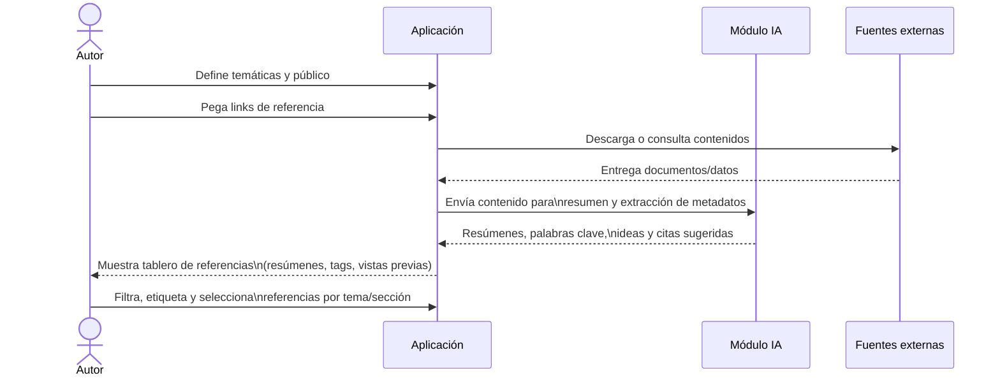
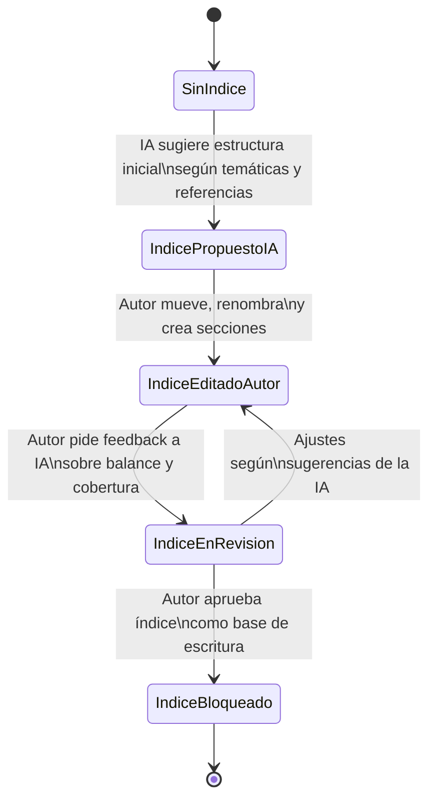
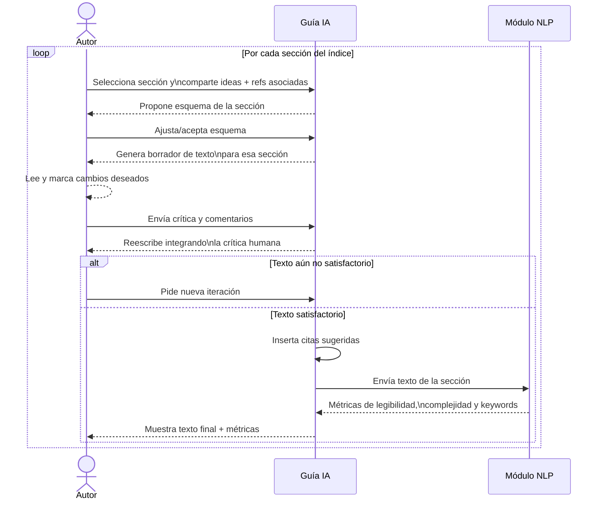

# PRD – Asistente de escritura guiada para autores

## 1. Contexto y propósito

### 1.1. Visión del producto

Construir una aplicación que acompañe a autores en el proceso de escritura de textos complejos (informes, PRD, capítulos, artículos), ayudándoles a pasar de un conjunto disperso de referencias a un documento final coherente, estructurado y legible.

La aplicación combina:

* Gestión de referencias.
* IA generativa para escritura asistida.
* Revisión humana central.
* Herramientas de NLP para calidad del texto.

### 1.2. Objetivo principal

Permitir que una persona autora pueda, en un solo flujo de trabajo:

1. Cargar referencias y comprenderlas.
2. Generar y refinar un índice del texto.
3. Desarrollar ideas intermedias (mesoscópicas) por sección.
4. Escribir, revisar e iterar secciones con IA.
5. Insertar citas y validar la calidad del texto (legibilidad, complejidad, palabras clave).

Resultado: un **borrador final listo para usarse como PRD o documento entregable**.

---

## 2. Alcance

### 2.1. Incluido en el MVP

* Carga de links y documentos como referencias.
* Extracción automática de resúmenes y palabras clave.
* Tablero simple de referencias con filtros y etiquetas.
* Generación de un índice sugerido por IA y edición manual.
* Registro de ideas por sección, conectadas a referencias.
* Generación de borradores por sección apoyados en IA.
* Flujo de iteración por sección (comentarios del autor → reescritura).
* Sugerencia e inserción básica de citas (formato único, por definir).
* Métricas básicas de NLP: legibilidad, longitud, densidad léxica, palabras clave.
* Exportación del documento final (Markdown/Docx/otro formato simple).

### 2.2. Fuera de alcance (por ahora)

* Colaboración multiusuario en tiempo real.
* Integraciones profundas con gestores de referencias (Zotero, Mendeley, etc.).
* Soporte multiidioma avanzado (se empieza en un idioma).
* Configuración avanzada de estilos de cita (APA/MLA/Chicago múltiples a la vez).
* Control de versiones detallado (se guardarán estados básicos, no un Git interno).

---

## 3. Usuarios y casos de uso

### 3.1. Persona principal

**Autor de texto / product owner / investigador**

* Tiene un conjunto amplio de referencias (links, PDFs, notas).
* Debe producir un documento estructurado (PRD, informe, capítulo, guía).
* Conoce el tema, pero no siempre tiene tiempo para “traducir” referencias a texto coherente.
* Quiere mantener el control autoral y la mirada crítica, sin delegar todo a la IA.

### 3.2. Casos de uso clave

* **CU1 – Cargar y organizar referencias:** el autor trae links y documentos, y la aplicación ayuda a resumir, etiquetar y visualizar.
* **CU2 – Generar y refinar índice:** la aplicación propone una estructura inicial y el autor la ajusta.
* **CU3 – Desarrollar ideas mesoscópicas:** el autor define qué quiere decir en cada sección, conectando ideas con referencias.
* **CU4 – Escribir y revisar secciones:** el sistema genera borradores por sección y el autor critica e itera.
* **CU5 – Validar texto final:** el sistema inserta citas y analiza legibilidad y complejidad del documento completo.

---

## 4. Flujos principales (con diagramas)

### 4.1. Flujo general de extremo a extremo

```mermaid
flowchart LR
    S([Inicio: Autor define objetivo])

    S --> A["Definir temáticas\n y público objetivo"]
    A --> B["Buscar y cargar referencias\n(links, documentos)"]
    B --> C["Extraer, resumir y visualizar\nlas referencias"]
    C --> D["Proponer índice asistido por IA"]
    D --> E["Refinar índice con revisión humana"]
    E --> F["Generar ideas mesoscópicas\npor sección"]
    F --> G["Escribir borradores de secciones\n(IA y/o autor)"]
    G --> H["Revisión crítica humana\npor sección"]
    H --> I{"¿Sección satisfactoria?"}

    I -- "No" --> J[Dar retroalimentación\nespecífica a la IA]
    J --> G

    I -- "Sí" --> K[Insertar y revisar citas\nsegún las referencias]
    K --> L[Análisis NLP:\nlegibilidad, complejidad,\npalabras clave]
    L --> M[Revisión global del texto]
    M --> N([Versión final lista\npara PRD / entregable])
```

---

### 4.2. Flujo de búsqueda y gestión de referencias

---

### 4.3. Flujo de índice: estados principales

---

### 4.4. Flujo de escritura por sección + crítica humana + NLP

---

## 5. Requerimientos funcionales (con vínculo a historias de usuario)

Lenguaje llano, pensado desde lo que ve y hace el usuario.

### 5.1. Gestión de referencias

* **RF-REF-01 – Carga de referencias**
  La aplicación debe permitir que el autor pegue links y suba documentos básicos (por ejemplo, PDF, texto).

  * Historias relacionadas: HU-REF-01, HU-REF-02.

* **RF-REF-02 – Extracción automática**
  Al cargar una referencia, el sistema debe extraer automáticamente:

  * Un resumen breve.
  * Palabras clave.
  * Datos básicos de cita (autor, año, título) cuando sea posible.
  * Historias relacionadas: HU-REF-01.

* **RF-REF-03 – Tablero de referencias**
  El autor debe poder ver todas las referencias en una vista única donde pueda:

  * Filtrar por etiqueta, tipo de documento o sección del índice.
  * Marcar referencias como “clave” o “secundaria”.
  * Historias relacionadas: HU-REF-02, HU-REF-03.

* **RF-REF-04 – Vinculación referencia–sección**
  El sistema debe permitir asociar cada referencia a una o varias secciones del índice.

  * Historias relacionadas: HU-REF-04, HU-IDEA-02.

---

### 5.2. Índice y estructura del texto

* **RF-IND-01 – Generación de índice sugerido por IA**
  A partir de las temáticas, el público objetivo y las referencias seleccionadas, el sistema debe proponer un índice inicial (capítulos y secciones).

  * Historias relacionadas: HU-IND-01.

* **RF-IND-02 – Edición visual del índice**
  El autor debe poder:

  * Renombrar secciones.
  * Mover secciones arriba/abajo.
  * Crear y eliminar subapartados.
  * Historias relacionadas: HU-IND-02.

* **RF-IND-03 – Revisión del índice por IA**
  El autor puede solicitar a la IA un comentario sobre el índice (secciones faltantes, sobrecarga, redundancias).

  * Historias relacionadas: HU-IND-03.

* **RF-IND-04 – Bloqueo del índice**
  Una vez que el autor está conforme con la estructura, puede “bloquear” el índice. Desde ese momento, la escritura por secciones se basa en ese índice y los cambios posteriores requieren una acción explícita.

  * Historias relacionadas: HU-IND-04.

---

### 5.3. Ideas mesoscópicas

* **RF-IDEA-01 – Notas de ideas por sección**
  Por cada sección del índice, el autor puede escribir ideas clave (argumentos, ejemplos, hipótesis).

  * Historias relacionadas: HU-IDEA-01.

* **RF-IDEA-02 – Asociación idea–referencia**
  Cada idea puede vincularse a una o varias referencias para mantener trazabilidad.

  * Historias relacionadas: HU-IDEA-02.

* **RF-IDEA-03 – Vista de mapa de ideas**
  El sistema debe ofrecer una vista (aunque sea simple al inicio) que muestre la relación entre:

  * Secciones del índice.
  * Ideas.
  * Referencias.
  * Historias relacionadas: HU-IDEA-03.

---

### 5.4. Escritura asistida y crítica humana

* **RF-WRITE-01 – Borrador de sección por IA**
  A partir del índice, las ideas y las referencias asociadas, el autor puede pedir a la IA que genere un borrador de una sección.

  * Historias relacionadas: HU-WRITE-01.

* **RF-WRITE-02 – Marcado de párrafos y comentarios**
  El autor debe poder seleccionar partes del texto (párrafos o frases) y dejar comentarios específicos (qué ajustar, qué mejorar).

  * Historias relacionadas: HU-WRITE-02.

* **RF-WRITE-03 – Iteraciones por sección**
  El sistema debe permitir múltiples iteraciones sobre una misma sección, conservando al menos:

  * La versión actual.
  * La última versión aceptada.
  * Historias relacionadas: HU-WRITE-03.

* **RF-WRITE-04 – Diferenciar texto humano vs IA**
  La interfaz debe indicar de manera visual qué fragmentos fueron generados por IA y cuáles fueron escritos o editados por el autor.

  * Historias relacionadas: HU-WRITE-04.

* **RF-WRITE-05 – Estado por sección**
  Cada sección del índice debe tener un estado visible (por ejemplo: “Sin empezar”, “En borrador”, “En revisión”, “Aprobada”).

  * Historias relacionadas: HU-WRITE-05.

---

### 5.5. Citas y análisis NLP

* **RF-CITE-01 – Sugerencia de citas**
  Cuando una sección usa referencias vinculadas, la aplicación debe sugerir citas en el texto (ej.: apellido y año).

  * Historias relacionadas: HU-CITE-01.

* **RF-CITE-02 – Edición de citas**
  El autor debe poder revisar y corregir estas citas antes de aprobar la versión de la sección.

  * Historias relacionadas: HU-CITE-02.

* **RF-NLP-01 – Métricas por sección**
  Por cada sección, el sistema debe mostrar métricas básicas:

  * Nivel de legibilidad (escala simple, ej.: fácil / medio / complejo).
  * Longitud (palabras, párrafos).
  * Densidad de vocabulario.
  * Historias relacionadas: HU-NLP-01.

* **RF-NLP-02 – Palabras clave y resumen**
  El sistema debe poder generar:

  * Palabras clave sugeridas por sección o capítulo.
  * Un breve resumen (abstract) del documento completo.
  * Historias relacionadas: HU-NLP-02.

* **RF-NLP-03 – Validación global**
  El autor puede ejecutar una “revisión global” que identifique:

  * Repeticiones excesivas.
  * Inconsistencias terminológicas.
  * Secciones desbalanceadas en longitud.
  * Historias relacionadas: HU-NLP-03.

---

## 6. Criterios de éxito y métricas

### 6.1. Criterios de éxito

* Al menos el **70 % de los usuarios** que inician un proyecto logran llegar a una versión final exportable.
* El sistema reduce en **al menos 30 %** el tiempo que el autor dice dedicar a pasar de referencias a un primer borrador.
* El **nivel de satisfacción** del autor con el producto, medido en una escala de 1 a 5, es ≥ 4 en:

  * Claridad de la estructura.
  * Utilidad de la IA en la escritura.
  * Utilidad del análisis NLP.

### 6.2. Métricas sugeridas

* Tiempo promedio desde “proyecto nuevo” hasta “primer borrador completo”.
* Número promedio de iteraciones por sección.
* Número promedio de referencias activamente usadas (conectadas a secciones).
* Porcentaje de secciones con legibilidad dentro del rango objetivo.

---

## 7. Riesgos y supuestos

### 7.1. Riesgos

* **Dependencia excesiva de la IA:** el autor podría aceptar textos sin revisar críticamente.
* **Calidad variable de las fuentes:** si las referencias son pobres, la IA puede reforzar errores.
* **Sobrecarga de interfaz:** demasiadas opciones pueden abrumar al usuario y dificultar el flujo.
* **Sesgos del modelo:** el tono y los ejemplos pueden no encajar con ciertos contextos o públicos.

### 7.2. Supuestos

* El usuario tiene un nivel básico de alfabetización digital y familiaridad con lectura académica/técnica.
* El modelo de IA y el módulo NLP ya están disponibles vía API interna o externa.
* El volumen de texto por proyecto es moderado (ej.: < 40–50 mil palabras) en el MVP.

---

## 8. Preguntas abiertas

* ¿Qué estilo de cita se soportará primero (ej.: solo APA en MVP)?
* ¿Cuál será el formato principal de exportación: Markdown, DOCX, PDF?
* ¿Se guardará un historial de versiones por sección o solo checkpoints clave?
* ¿Qué idioma será el inicial del sistema (español, inglés) y cómo se manejarán mezclas?
* ¿Habrá plantillas de proyecto (PRD, artículo, capítulo) o un único tipo genérico al inicio?